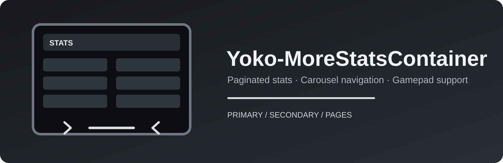

<div align="center">
  
</div>

# Yoko-MoreStatsContainer

[](https://github.com/CYoJkoY/Yoko-MoreStatsContainer/releases)
[](LICENSE)
[](https://github.com/CYoJkoY/Yoko-MoreStatsContainer/actions/workflows/release.yml)

> A paginated replacement layer for Brotato's in-game stats container.

Yoko-MoreStatsContainer extends Brotato's `stats_container.gd` so large stat lists remain usable instead of growing into an unwieldy single page. Primary and secondary stats are divided into pages, with a compact carousel providing navigation while preserving the original stats container's layout and focus behavior.

## Features

### Paginated statistics

- Primary stats are grouped into pages of up to **16 entries**.
- Secondary stats are grouped into pages of up to **19 entries**.
- The active page is displayed without changing the underlying stat data.
- The container height is stabilized so switching pages does not cause the surrounding UI to jump vertically.

### Carousel navigation

- Dedicated previous/next controls.
- Optional `current / total` page indicator.
- Navigation automatically disables when there is no previous or next page.
- Focus is restored to the current page after changing pages.

### Gamepad support

When the player is using a gamepad, the carousel can display the player's remapped trigger prompts and use the left/right triggers for page navigation.

The carousel is player-aware and reads the active player's remapped input device through Brotato's `CoopService`.

## Installation

Download the latest `MoreStatsContainer-*.zip` from [Releases](https://github.com/CYoJkoY/Yoko-MoreStatsContainer/releases) and place it in the game's `mods` directory used by Godot Mod Loader. The release ZIP is intended to remain zipped for normal installation.

For development, the relevant structure is:

```text
mods-unpacked/
└── Yoko-MoreStatsContainer/
    ├── extensions/
    │   ├── stats_container.gd
    │   └── stats_carousel/
    ├── manifest.json
    └── mod_main.gd
```

See the [Godot Mod Loader documentation](https://github.com/GodotModding/godot-mod-loader/wiki) for the current mod installation conventions.

## Usage

No in-game configuration is required.

Open the normal Brotato stats screen. When the number of stats exceeds the per-page limit, use the carousel controls to move between pages. With compatible gamepad input, the carousel can also use the active player's left/right triggers.

## How it works

The mod installs a script extension for Brotato's existing `res://ui/menus/shop/stats_container.gd`. At initialization it creates the carousel, partitions the original primary and secondary stat nodes into groups, inserts inert filler nodes when needed, and manages visibility and focus as the current page changes.

The core implementation is intentionally additive: the original `update_tab()` behavior is called first and the pagination layer is updated around it.

```text
extensions/
├── stats_container.gd
└── stats_carousel/
    ├── stats_carousel.gd
    └── stats_carousel.tscn
```

## Compatibility

| Component | Target |
| :--- | :--- |
| Engine | Godot 3.x / GDScript |
| Mod Loader | 6.1.0 (manifest target) |
| Dependencies | None declared |
| Version | 1.0.0 |

The exact game version is not reliably specified by the current manifest, so verify compatibility against your Brotato build and active Mod Loader version.

## Development

The main entry point is `mod_main.gd`. It installs `stats_container.gd`, which extends the game's built-in stats container. The carousel is implemented as a reusable custom `Container` with signals for page changes and arrow navigation.

Release builds are generated automatically from semantic version tags such as:

```text
v1.0.0
v1.1.0
v2.0.0
```

## License

This project is licensed under the [MIT License](LICENSE).

## 💰 Support the Author

If this project saves you time or improves your workflow, consider supporting its development.

<div align="center">
  <a href="https://cyojkoy.github.io/Payment/">
    
  </a>
</div>

---

<div align="center">
  <sub>Yoko-MoreStatsContainer · Brotato UI extension by CYoJkoY</sub>
</div>
