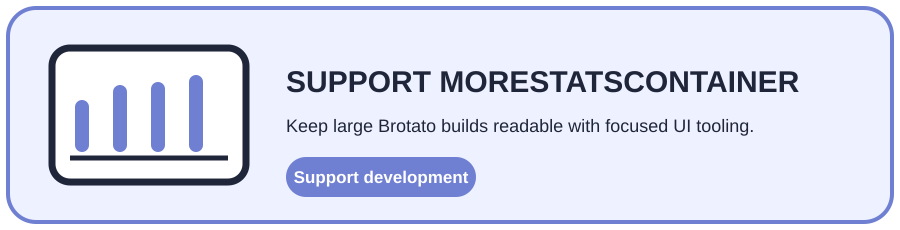

<div align="center">
  <h1>Yoko-MoreStatsContainer</h1>
  <p><strong>Turn an oversized Brotato stat list into a compact, navigable interface.</strong></p>
  <p>Pagination · Primary / Secondary stats · Carousel · Focus · Controller</p>
  <p>
    <a href="https://github.com/CYoJkoY/Yoko-MoreStatsContainer/releases"></a>
    <a href="https://github.com/CYoJkoY/Yoko-MoreStatsContainer/actions/workflows/release.yml"></a>
    
    
    <a href="LICENSE"></a>
  </p>
  <p><a href="#the-problem">Problem</a> · <a href="#behavior">Behavior</a> · <a href="#architecture">Architecture</a> · <a href="#installation">Install</a> · <a href="#development--support">Development</a></p>
</div>

> **Design boundary:** this mod changes presentation and navigation, not Brotato's underlying stat calculation or storage model.

##  The problem

Large Brotato builds can expose more statistics than the default container can present comfortably. MoreStatsContainer keeps the original update path, then turns the resulting list into pages instead of allowing the panel to grow without structure.

##  Behavior

| Feature | Behavior |
| :--- | :--- |
| Primary stats | Up to **16 entries per page** |
| Secondary stats | Up to **19 entries per page** |
| Carousel | Previous / next navigation with optional `current / total` feedback |
| Layout | Page changes keep the surrounding panel stable |
| Focus | Focus is restored after navigation |
| Gamepad | Uses active-player remapped left/right trigger input through `CoopService` |

No additional in-game configuration is required.

##  Architecture

The implementation extends Brotato's existing `res://ui/menus/shop/stats_container.gd` rather than replacing the statistics system.

```text
Brotato stats container
        │
        ▼
extensions/stats_container.gd
        │
        ├── run original stat update
        ├── group primary / secondary entries
        ├── create pages
        └── update carousel + focus
                    │
                    ▼
             stats_carousel.tscn
```

The extension wraps the original update path; pagination remains independent from stat calculation.

##  Installation

Requirements: **Brotato 1.15.4** and **Brotato Mod Loader 6.3.0**.

Download `MoreStatsContainer-*.zip` from [Releases](https://github.com/CYoJkoY/Yoko-MoreStatsContainer/releases) and place the ZIP in the Mod Loader `mods` directory.

```text
mods-unpacked/
└── Yoko-MoreStatsContainer/
    ├── extensions/
    ├── manifest.json
    └── mod_main.gd
```

##  Development & support

`mod_main.gd` is the entry point. `extensions/stats_container.gd` handles the game-specific integration and `extensions/stats_carousel/` contains the reusable navigation component.

Keep release tags synchronized with `manifest.json` version **1.1.0** and test controller navigation when changing focus or page behavior.

<a href="https://cyojkoy.github.io/Payment/"></a>

Development support: **https://cyojkoy.github.io/Payment/**

## License

This project is licensed under the [MIT License](LICENSE).
